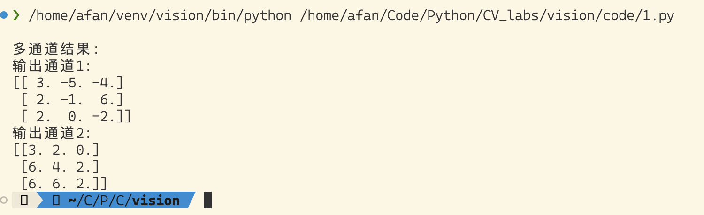
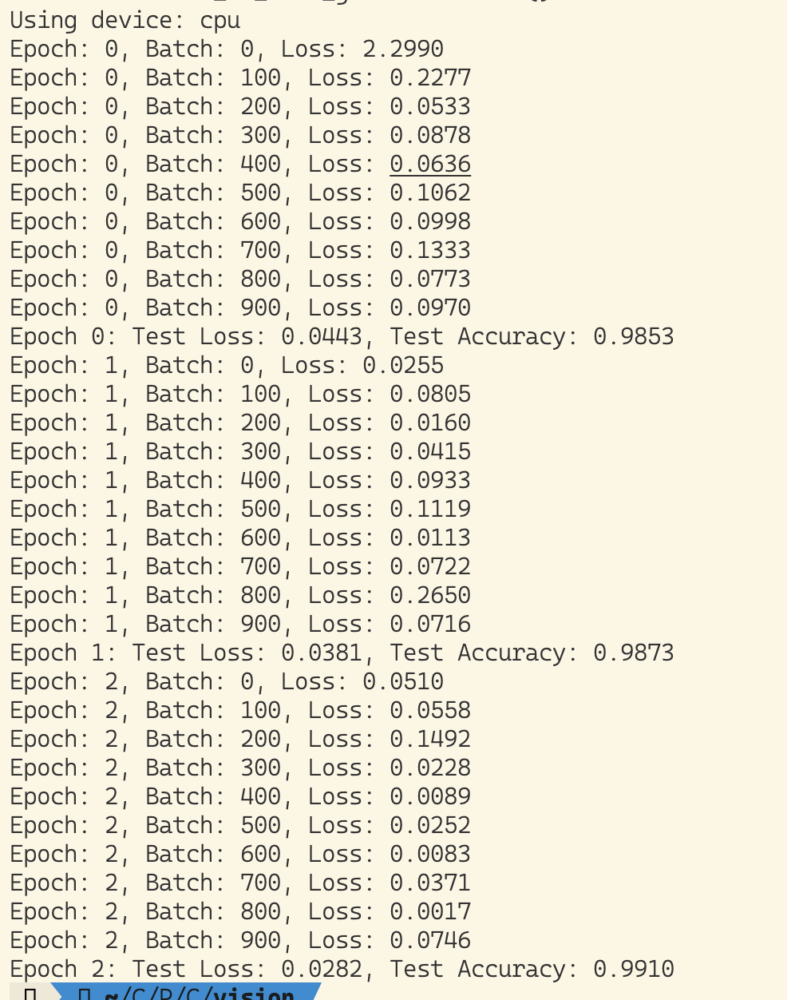
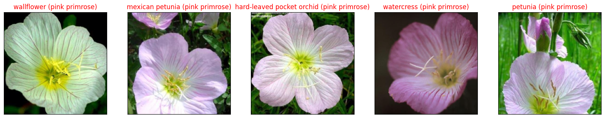
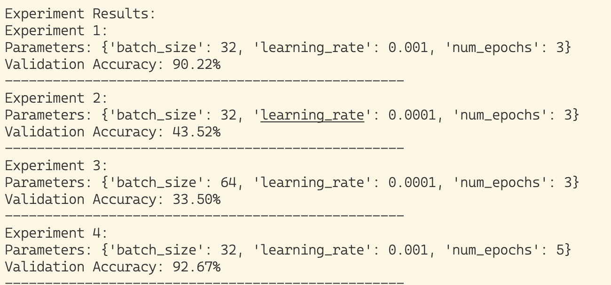
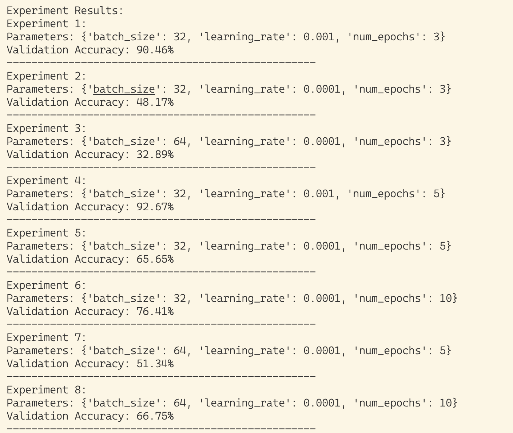

# 第二次实验课

1210604006

## 实验一

### 结果



### 代码

```python
import numpy as np
import torch
from torch import nn

# 任务：多通道卷积计算

import numpy as np

"""
    执行多通道2D卷积计算（带bias）
    参数:
        input_matrix: 输入矩阵 (channels, height, width)
        kernel: 卷积核 (out_channels, in_channels, kernel_height, kernel_width)
        bias: 偏置 (out_channels,)，默认为None
        stride: 步幅，默认为1
        padding: 填充，默认为0
    返回:
        output: 卷积结果 (out_channels, output_height, output_width)
"""
def convolution_multi_channel(input_matrix, kernel, bias=None, stride=1, padding=0):
        
        # 转换为numpy数组
        input_matrix = np.array(input_matrix)
        kernel = np.array(kernel)
        
        # 获取维度信息
        if len(input_matrix.shape) == 2:  # 单通道情况
            input_matrix = input_matrix[np.newaxis, :, :]
        in_channels, input_h, input_w = input_matrix.shape
        
        if len(kernel.shape) == 2:  # 单输入单输出情况
            kernel = kernel[np.newaxis, np.newaxis, :, :]
        out_channels, kernel_in_channels, kernel_h, kernel_w = kernel.shape
        
        # 验证输入通道数是否匹配
        if in_channels != kernel_in_channels:
            raise ValueError("输入矩阵的通道数必须与kernel的输入通道数匹配")
        
        # 处理bias
        if bias is None:
            bias = np.zeros(out_channels)
        
        # 添加padding
        input_matrix = np.pad(input_matrix, ((0, 0), (padding, padding), (padding, padding)), mode='constant')
        # 计算输出尺寸
        output_h = (input_h - kernel_h + 2 * padding) // stride + 1
        output_w = (input_w - kernel_w + 2 * padding) // stride + 1
        
        # 初始化输出矩阵
        output = np.zeros((out_channels, output_h, output_w))
        
        # 执行卷积操作
        for out_channel in range(out_channels):
            for h in range(output_h):
                for w in range(output_w):
                    output[out_channel, h, w] = np.sum(
                        input_matrix[:, h*stride:h*stride+kernel_h, w*stride:w*stride+kernel_w] * kernel[out_channel, :, :, :]
                    ) + bias[out_channel]
        
        return output


# 示例2：多通道输入
input_multi = np.array([
        [[1, 1, 2, 2, 1],    # 通道1
         [1, 1, 1, 2, 1],
         [2, 1, 1, 0, 2],
         [2, 1, 0, 1, 2],
         [2, 1, 2, 2, 2]],
        [[0, 1, 2, 0, 1],    # 通道2
         [2, 2, 1, 1, 0],
         [1, 0, 0, 0, 2],
         [0, 1, 0, 1, 2],
         [0, 1, 0, 1, 2]],
         [[2, 2, 0, 1, 2],
          [0, 0, 2, 1, 2],
          [2, 1, 0, 2, 1],
          [1, 1, 0, 0, 0],
          [0, 0, 1, 1, 1]]
    ])
kernel_multi = np.array([
        [              # 输出通道1
            [[1, 1, 1],   # 输入通道1的kernel
             [-1, -1, 0],
             [-1, 1, 0]],
            [[-1, -1, 1],   # 输入通道2的kernel
             [-1, 1, 0],
             [-1, 1, 0]],
             [[1, 0, -1],   # 输入通道3的kernel
              [0, 0, 0],
              [1, -1, -1]]
        ],
        [              # 输出通道2
            [[0, 0, -1],   # 输入通道1的kernel
             [-1, 1, 1],
             [0, 0, 0]],
            [[0, 0, 1],   # 输入通道2的kernel
             [1, 0, 1],
             [0, -1, -1]],
             [[-1, 1, 1],   # 输入通道3的kernel
              [0, 1, 1],
              [1, -1, 1]]
        ]
    ])
bias = np.array([1, 0])  # 为每个输出通道定义bias
    
print("\n多通道结果:")
result2 = convolution_multi_channel(input_multi, kernel_multi, bias, stride=2, padding=1)
print("输出通道1:")
print(result2[0])
print("输出通道2:")
print(result2[1])
```


## 实验二

### 结果



### 代码

```python
import torch
import torch.nn as nn
import torch.optim as optim
import torch.nn.functional as F
from torchvision import datasets, transforms
import matplotlib.pyplot as plt
import numpy as np

# 定义超参数
input_size = 28  # 输入尺寸
num_classes = 10  # 类别数量
num_epochs = 3  # 训练周期数
batch_size = 64  # 批次大小

# Check for CUDA availability with better error handling
try:
    device = torch.device('cuda' if torch.cuda.is_available() else 'cpu')
    if torch.cuda.is_available():
        # Test CUDA functionality
        torch.zeros(1).cuda()  # Simple test to verify CUDA works
    print(f"Using device: {device}")
except RuntimeError as e:
    print(f"CUDA unavailable: {e}")
    device = torch.device('cpu')
    print(f"Falling back to: {device}")

# 加载数据集
train_dataset = datasets.MNIST(
    root='../data',    
    # 数据集存放目录
    train=True,       
    # 使用训练集
    transform=transforms.ToTensor(),
    download=True   
)

test_dataset = datasets.MNIST(
    root='../data',
    train=False,
    transform=transforms.ToTensor(),
    download=False
)

# 创建数据加载器
train_loader = torch.utils.data.DataLoader(
    train_dataset,
    batch_size=batch_size,
    shuffle=True
)
test_loader = torch.utils.data.DataLoader(
    test_dataset,
    batch_size=batch_size,
    shuffle=False
)

# 定义CNN模型
class CNN(nn.Module):  # 定义CNN类
    def __init__(self):
        # 初始化层（卷积层、激活函数、池化层、全连接层）
        super(CNN, self).__init__()
        self.conv1 = nn.Conv2d(1, 16, kernel_size=5, stride=1, padding=2)
        self.relu = nn.ReLU()
        self.pool = nn.MaxPool2d(kernel_size=2)

        self.conv2 = nn.Conv2d(16, 32, kernel_size=5, stride=1, padding=2)
        self.relu2 = nn.ReLU()
        self.pool2 = nn.MaxPool2d(kernel_size=2)
        
        self.conv3 = nn.Conv2d(32, 64, kernel_size=5, stride=1, padding=2)
        self.relu3 = nn.ReLU()
        # self.pool3 = nn.MaxPool2d(kernel_size=2, padding=1)

        self.fc = nn.Linear(64 * 7 * 7, 10)
    
    def forward(self, x):
        # 前向传播
        x = self.conv1(x)
        x = self.relu(x)
        x = self.pool(x)

        x = self.conv2(x)
        x = self.relu2(x)
        x = self.pool2(x)

        x = self.conv3(x)
        x = self.relu3(x)
        # x = self.pool3(x)

        x = x.view(x.size(0), -1)  # 展平操作
        x = self.fc(x)
        return x

# 定义准确率计算函数
def accuracy(predictions, labels):
    # 计算准确率
    return (predictions.argmax(dim=1) == labels).float().mean()

# 实例化模型、损失函数和优化器
net = CNN().to(device)
criterion = nn.CrossEntropyLoss()  # 定义损失函数
optimizer = optim.Adam(net.parameters(), lr=0.001)  # 定义优化器

# 训练循环
for epoch in range(num_epochs):
    net.train()
    for batch_idx, (data, target) in enumerate(train_loader):
        # 将数据移动到正确的设备上
        data, target = data.to(device), target.to(device)
        
        optimizer.zero_grad()
        output = net(data)
        loss = criterion(output, target)
        loss.backward()
        optimizer.step()
        
        if batch_idx % 100 == 0:
            print(f'Epoch: {epoch}, Batch: {batch_idx}, Loss: {loss.item():.4f}')
    
    # 每个epoch结束后评估模型
    net.eval()
    test_loss = 0
    test_accuracy = 0
    with torch.no_grad():
        for data, target in test_loader:
            data, target = data.to(device), target.to(device)
            output = net(data)
            test_loss += criterion(output, target).item()
            test_accuracy += accuracy(output, target).item()
    
    test_loss /= len(test_loader)
    test_accuracy /= len(test_loader)
    print(f'Epoch {epoch}: Test Loss: {test_loss:.4f}, Test Accuracy: {test_accuracy:.4f}')

# 保存模型
torch.save(net.state_dict(), './result/2_model.pth')
```


## 实验三

### 结果


### 代码

```python
# 导入必要的库
import os
os.environ["KMP_DUPLICATE_LIB_OK"]="TRUE"
import os
import matplotlib.pyplot as plt
import numpy as np
import torch
from torch import nn
import torch.optim as optim
from torchvision import transforms, models, datasets
import time
import copy
from PIL import Image
import json


device = torch.device("cuda")

# 定义数据预处理
data_transforms = {
    'train': transforms.Compose([
        transforms.RandomResizedCrop(224),
        transforms.RandomHorizontalFlip(),
        transforms.ToTensor(),
        transforms.Normalize([0.485, 0.456, 0.406], [0.229, 0.224, 0.225])
    ]),
    'valid': transforms.Compose([
        transforms.Resize(256),
        transforms.CenterCrop(224),
        transforms.ToTensor(),
        transforms.Normalize([0.485, 0.456, 0.406], [0.229, 0.224, 0.225])
    ])
}

# 加载数据集
data_dir = 'data/flower_data'
image_datasets = {
    'train': datasets.ImageFolder(os.path.join(data_dir, 'train'), data_transforms['train']),
    'valid': datasets.ImageFolder(os.path.join(data_dir, 'valid'), data_transforms['valid'])
}

dataloaders = {
    'train': torch.utils.data.DataLoader(image_datasets['train'], batch_size=32, shuffle=True, num_workers=4),
    'valid': torch.utils.data.DataLoader(image_datasets['valid'], batch_size=32, shuffle=False, num_workers=4)
}

# 初始化并调整ResNet18模型
def initialize_model(num_classes, feature_extract, use_pretrained=True):
    # 从本地加载预训练模型
    model_ft = models.resnet18(use_pretrained)
    # 调整最后一层
    num_features = model_ft.fc.in_features
    model_ft.fc = nn.Linear(num_features, num_classes)
    model_ft = model_ft.to(device)
    return model_ft

def set_parameter_requires_grad(model, feature_extracting):
    # 设置参数是否需要梯度更新
    if feature_extracting:
        for param in model.parameters():
            param.requires_grad = False
    else:
        for param in model.parameters():
            param.requires_grad = True

# 训练模型
def train_model(model, dataloaders, criterion, optimizer, num_epochs=2, is_inception=False, filename='./result/3_checkpoint.pth', scheduler=None):
    since = time.time()
    best_model_wts = copy.deepcopy(model.state_dict())
    best_acc = 0.0

    for epoch in range(num_epochs):
        print(f'Epoch {epoch}/{num_epochs - 1}')
        print('-' * 10)

        # 每个epoch都有训练和验证阶段
        for phase in ['train', 'valid']:
            if phase == 'train':
                model.train()
            else:
                model.eval()

            running_loss = 0.0
            running_corrects = 0

            # 迭代数据
            for inputs, labels in dataloaders[phase]:
                inputs = inputs.to(device)
                labels = labels.to(device)

                # 梯度清零
                optimizer.zero_grad()

                # 前向传播
                with torch.set_grad_enabled(phase == 'train'):
                    outputs = model(inputs)
                    _, preds = torch.max(outputs, 1)
                    loss = criterion(outputs, labels)

                    # 反向传播 + 优化器更新（仅在训练阶段）
                    if phase == 'train':
                        loss.backward()
                        optimizer.step()

                # 统计
                running_loss += loss.item() * inputs.size(0)
                running_corrects += torch.sum(preds == labels.data)

            if phase == 'train' and scheduler is not None:
                scheduler.step()

            epoch_loss = running_loss / len(dataloaders[phase].dataset)
            epoch_acc = running_corrects.double() / len(dataloaders[phase].dataset)

            print(f'{phase} Loss: {epoch_loss:.4f} Acc: {epoch_acc:.4f}')

            # 保存最佳模型
            if phase == 'valid' and epoch_acc > best_acc:
                best_acc = epoch_acc
                best_model_wts = copy.deepcopy(model.state_dict())
                # 保存检查点
                torch.save({
                    'epoch': epoch,
                    'state_dict': best_model_wts,
                    'optimizer_state_dict': optimizer.state_dict(),
                    'best_acc': best_acc,
                }, filename)

        print()

    time_elapsed = time.time() - since
    print(f'Training complete in {time_elapsed // 60:.0f}m {time_elapsed % 60:.0f}s')
    print(f'Best val Acc: {best_acc:4f}')

    # 加载最佳模型权重
    model.load_state_dict(best_model_wts)
    return model

# 在模型保存之前，先创建保存目录
# 创建保存模型的目录
save_dir = './result'
if not os.path.exists(save_dir):
    os.makedirs(save_dir)

# 模型保存路径
filename = './result/3_checkpoint.pth'

# 初始化并训练模型（第一阶段）
model_ft = initialize_model(102, feature_extract=True, use_pretrained=True)

# 定义损失函数
criterion = nn.CrossEntropyLoss()

# 定义优化器和学习率调度器
optimizer_ft = torch.optim.Adam(model_ft.parameters(), lr=1e-6)
scheduler = torch.optim.lr_scheduler.StepLR(optimizer_ft, step_size=7, gamma=0.1)

# 训练模型（第一阶段）
model_ft = train_model(model_ft, dataloaders, criterion, optimizer_ft, num_epochs=2, filename=filename, scheduler=scheduler)

# 加载训练好的模型
try:
    checkpoint = torch.load(filename)
    model_dict = model_ft.state_dict()
    # 过滤出匹配的权重
    pretrained_dict = {k: v for k, v in checkpoint['state_dict'].items() if k in model_dict and model_dict[k].size() == v.size()}
    model_dict.update(pretrained_dict) 
    model_ft.load_state_dict(model_dict)
    print("Successfully loaded checkpoint from", filename)
except FileNotFoundError:
    print(f"No checkpoint found at {filename}, starting from scratch")
    pass

model_ft.to(device)  # 确保模型被移动到了正确的设备

# 解冻所有参数并继续训练（第二阶段）
# 解冻模型所有参数
set_parameter_requires_grad(model_ft, False)

# 定义新的优化器和学习率调度器
optimizer = torch.optim.Adam(model_ft.parameters(), lr=1e-3)
scheduler = torch.optim.lr_scheduler.StepLR(optimizer, step_size=7, gamma=0.1)

# 训练模型（第二阶段）
model_ft = train_model(model_ft, dataloaders, criterion, optimizer, num_epochs=2, filename=filename, scheduler=scheduler)

# 加载训练好的模型
checkpoint = torch.load(filename)
model_dict = model_ft.state_dict()

# 过滤出匹配的权重
pretrained_dict = {k: v for k, v in checkpoint['state_dict'].items() if k in model_dict and model_dict[k].size() == v.size()}
model_dict.update(pretrained_dict) 
model_ft.load_state_dict(model_dict)

model_ft.to(device)  # 确保模型被移动到了正确的设备

# 加载测试图片并进行预测
def process_image(image_path):
    # 读取测试数据
    img = Image.open(image_path)
    # Resize,thumbnail方法只能进行缩小，所以进行了判断
    if img.size[0] > img.size[1]:
        img.thumbnail((10000, 256))
    else:
        img.thumbnail((256, 10000))
    # Crop操作
    left_margin = (img.width-224)/2
    bottom_margin = (img.height-224)/2
    right_margin = left_margin + 224
    top_margin = bottom_margin + 224
    img = img.crop((left_margin, bottom_margin, right_margin,   
                      top_margin))
    # 相同的预处理方法
    img = np.array(img)/255
    mean = np.array([0.485, 0.456, 0.406]) #provided mean
    std = np.array([0.229, 0.224, 0.225]) #provided std
    img = (img - mean)/std
    
    # 注意颜色通道应该放在第一个位置
    img = img.transpose((2, 0, 1))
    
    return img

# 在测试图片预测部分，添加缺失的代码
def predict(image_path, model, topk=5):
    """使用训练好的模型进行预测"""
    model.eval()
    img = process_image(image_path)
    # 将numpy array转换为torch tensor
    img = torch.from_numpy(img).type(torch.FloatTensor)
    # 增加batch维度
    img = img.unsqueeze(0)
    img = img.to(device)
    
    with torch.no_grad():
        output = model(img)
        # 获取概率
        probabilities = torch.nn.functional.softmax(output, dim=1)
        top_probs, top_indices = torch.topk(probabilities, topk)
        
    return top_probs.cpu().numpy()[0], top_indices.cpu().numpy()[0]

# 展示预测结果部分的完善
# 获取一个batch的测试数据
dataiter = iter(dataloaders['valid'])
images, labels = next(dataiter)

# 将数据移动到正确的设备
images = images.to(device)
labels = labels.to(device)

# 将模型设置为评估模式
model_ft.eval()

# 进行预测
with torch.no_grad():
    output = model_ft(images)

# 得到概率最大的预测结果
_, preds_tensor = torch.max(output, 1)
preds = preds_tensor.cpu().numpy()

# 单张图片的预测示例
def predict_single_image(image_path, model, cat_to_name):
    """预测单张图片并返回预测结果"""
    # 获取前k个预测结果
    probs, classes = predict(image_path, model)
    
    # 获取类别名称
    class_names = [cat_to_name[str(cls)] for cls in classes]
    
    return probs, class_names

# 添加模型评估函数
def evaluate_model(model, dataloader):
    """评估模型在测试集上的性能"""
    model.eval()
    correct = 0
    total = 0
    
    with torch.no_grad():
        for inputs, labels in dataloader:
            inputs = inputs.to(device)
            labels = labels.to(device)
            
            outputs = model(inputs)
            _, predicted = torch.max(outputs.data, 1)
            
            total += labels.size(0)
            correct += (predicted == labels).sum().item()
    
    return 100 * correct / total

# 在主程序最后添加模型评估
print("\nEvaluating model performance...")
val_accuracy = evaluate_model(model_ft, dataloaders['valid'])
print(f"Validation Accuracy: {val_accuracy:.2f}%")

# 保存完整模型（包括架构）
torch.save({
    'model_state_dict': model_ft.state_dict(),
    'optimizer_state_dict': optimizer.state_dict(),
    'class_to_idx': image_datasets['train'].class_to_idx,
}, './result/3_complete_model.pth')

# 示例：预测单张图片
def predict_and_display_image(image_path, model, cat_to_name):
    """预测并显示单张图片的结果"""
    # 预测
    probs, classes = predict_single_image(image_path, model, cat_to_name)
    
    # 显示图片和预测结果
    img = Image.open(image_path)
    fig, (ax1, ax2) = plt.subplots(figsize=(12,5), ncols=2)
    
    # 显示图片
    ax1.imshow(img)
    ax1.axis('off')
    ax1.set_title('Input Image')
    
    # 显示预测结果
    y_pos = np.arange(len(classes))
    ax2.barh(y_pos, probs)
    ax2.set_yticks(y_pos)
    ax2.set_yticklabels(classes)
    ax2.invert_yaxis()
    ax2.set_title('Top Predictions')
    
    plt.tight_layout()
    plt.savefig("./result/3_single_prediction.png")
    plt.close()

# 如果要测试单张图片，可以使用以下代码：
# test_image_path = 'path_to_your_test_image.jpg'
# predict_and_display_image(test_image_path, model_ft, cat_to_name)

# 加载类别名称
with open('./data/cat_to_name.json', 'r') as f:
    cat_to_name = json.load(f)

import matplotlib
matplotlib.use('Agg')  # 使用无图形界面的后端

def im_convert(tensor):
    """ 将 PyTorch tensor 转换为可显示的图像格式 """
    # 复制一份以防修改原始数据
    image = tensor.cpu().clone().detach().numpy()
    # 将图像从 CxHxW 转换为 HxWxC 格式
    image = image.transpose(1, 2, 0)
    # 反归一化
    mean = np.array([0.485, 0.456, 0.406])
    std = np.array([0.229, 0.224, 0.225])
    image = std * image + mean
    # 裁剪到 [0,1] 范围
    image = np.clip(image, 0, 1)
    return image

# 获取类别到索引的映射
class_to_idx = image_datasets['train'].class_to_idx
# 创建索引到类别的反向映射
idx_to_class = {v: k for k, v in class_to_idx.items()}

fig = plt.figure(figsize=(20, 20))
columns = 1
rows = 1

ax = fig.add_subplot(rows, columns, 1, xticks=[], yticks=[])
ax.imshow(im_convert(images[0]))
ax.set_title(
    "{} ({})".format(
        cat_to_name[idx_to_class[preds[0]]],  # 使用idx_to_class进行映射
        cat_to_name[idx_to_class[labels[0].item()]]  # 使用idx_to_class进行映射
    ),
    color=("green" if preds[0] == labels[0].item() else "red")
)

# 保存图像
plt.savefig("./result/3_prediction_result.png", bbox_inches='tight', pad_inches=0)

# 关闭 figure，释放资源
plt.close(fig)
```


## 附加

### 结果





| batch_size | learning_rate | num_epochs | Accuracy |
| ---------- | ------------- | ---------- | -------- |
| 32         | 1e-3          | 3          | 90.22%   |
| 32         | 1e-4          | 3          | 43.52%   |
| 64         | 1e-4          | 3          | 33.50%   |
| 32         | 1e-3          | 5          | 92.67%   |

num_epochs: 实验1和实验4训练批次不同，4的实现效果稍好

learning_rate: 实验1和实验2学习率不同，实验2的最终效果很差，应该是批次太少，

batch_size: 实验2和实验3只批次不同，效果都很差，并不能看出什么，两个实验都增加训练次数，重新训练一下。



通过提高训练次数，1e-4的学习率训练出来的模型效果有所提升，但是仍未达到预期。

### 代码

```python
# main.py
import os
import json
import time
import copy
import matplotlib
matplotlib.use('Agg')
import matplotlib.pyplot as plt
import numpy as np
import torch
from torch import nn
import torch.optim as optim
from torchvision import transforms, models, datasets
from PIL import Image

from config import param_combinations, base_config


class FlowerClassifier:
    def __init__(self, config):
        """初始化分类器配置"""
        self.config = config
        self.device = torch.device("cuda" if torch.cuda.is_available() else "cpu")
        self.setup_directories()
        self.load_data()
        self.initialize_model()
        
    def setup_directories(self):
        """创建必要的目录"""
        os.makedirs(self.config['result_dir'], exist_ok=True)
        
    def load_data(self):
        """加载和预处理数据"""
        # 定义数据预处理
        data_transforms = {
            'train': transforms.Compose([
                transforms.RandomResizedCrop(self.config['image_size']),
                transforms.RandomHorizontalFlip(),
                transforms.ToTensor(),
                transforms.Normalize([0.485, 0.456, 0.406], [0.229, 0.224, 0.225])
            ]),
            'valid': transforms.Compose([
                transforms.Resize(self.config['image_size'] + 32),
                transforms.CenterCrop(self.config['image_size']),
                transforms.ToTensor(),
                transforms.Normalize([0.485, 0.456, 0.406], [0.229, 0.224, 0.225])
            ])
        }

        # 加载数据集
        self.image_datasets = {
            'train': datasets.ImageFolder(
                os.path.join(self.config['data_dir'], 'train'), 
                data_transforms['train']),
            'valid': datasets.ImageFolder(
                os.path.join(self.config['data_dir'], 'valid'), 
                data_transforms['valid'])
        }

        self.dataloaders = {
            'train': torch.utils.data.DataLoader(
                self.image_datasets['train'], 
                batch_size=self.config['batch_size'], 
                shuffle=True, 
                num_workers=4),
            'valid': torch.utils.data.DataLoader(
                self.image_datasets['valid'], 
                batch_size=self.config['batch_size'], 
                shuffle=False, 
                num_workers=4)
        }
        
        # 加载类别名称
        with open(self.config['cat_to_name_path'], 'r') as f:
            self.cat_to_name = json.load(f)
            
        self.class_to_idx = self.image_datasets['train'].class_to_idx
        self.idx_to_class = {v: k for k, v in self.class_to_idx.items()}
    
    def initialize_model(self):
        """初始化模型"""
        # 加载预训练模型
        self.model = models.resnet18(pretrained=self.config['use_pretrained'])
        
        # 冻结或解冻参数
        self.set_parameter_requires_grad(self.model, self.config['feature_extract'])
        
        # 调整最后一层
        num_features = self.model.fc.in_features
        self.model.fc = nn.Linear(num_features, len(self.class_to_idx))
        self.model = self.model.to(self.device)
        
        # 定义损失函数
        self.criterion = nn.CrossEntropyLoss()
        
        # 定义优化器
        params_to_update = self.get_params_to_update()
        self.optimizer = optim.Adam(
            params_to_update, 
            lr=self.config['learning_rate']
        )
        
        # 定义学习率调度器
        self.scheduler = optim.lr_scheduler.StepLR(
            self.optimizer, 
            step_size=self.config['scheduler_step_size'], 
            gamma=self.config['scheduler_gamma']
        )
    
    def set_parameter_requires_grad(self, model, feature_extracting):
        """设置参数是否需要梯度更新"""
        if feature_extracting:
            for param in model.parameters():
                param.requires_grad = False
    
    def get_params_to_update(self):
        """获取需要更新的参数"""
        params_to_update = []
        for name, param in self.model.named_parameters():
            if param.requires_grad:
                params_to_update.append(param)
        return params_to_update
    
    def train(self):
        """训练模型"""
        since = time.time()
        best_acc = 0.0
        history = {'train_loss': [], 'train_acc': [], 'val_loss': [], 'val_acc': []}
        
        for epoch in range(self.config['num_epochs']):
            print(f'Epoch {epoch}/{self.config["num_epochs"] - 1}')
            print('-' * 10)

            # 每个epoch都有训练和验证阶段
            for phase in ['train', 'valid']:
                if phase == 'train':
                    self.model.train()
                else:
                    self.model.eval()

                running_loss = 0.0
                running_corrects = 0

                # 迭代数据
                for inputs, labels in self.dataloaders[phase]:
                    inputs = inputs.to(self.device)
                    labels = labels.to(self.device)

                    # 梯度清零
                    self.optimizer.zero_grad()

                    # 前向传播
                    with torch.set_grad_enabled(phase == 'train'):
                        outputs = self.model(inputs)
                        _, preds = torch.max(outputs, 1)
                        loss = self.criterion(outputs, labels)

                        # 反向传播 + 优化器更新（仅在训练阶段）
                        if phase == 'train':
                            loss.backward()
                            self.optimizer.step()

                    # 统计
                    running_loss += loss.item() * inputs.size(0)
                    running_corrects += torch.sum(preds == labels.data)

                if phase == 'train':
                    self.scheduler.step()

                epoch_loss = running_loss / len(self.dataloaders[phase].dataset)
                epoch_acc = running_corrects.double() / len(self.dataloaders[phase].dataset)
                
                # 记录历史数据
                if phase == 'train':
                    history['train_loss'].append(epoch_loss)
                    history['train_acc'].append(epoch_acc.item())
                else:
                    history['val_loss'].append(epoch_loss)
                    history['val_acc'].append(epoch_acc.item())

                print(f'{phase} Loss: {epoch_loss:.4f} Acc: {epoch_acc:.4f}')

                # 保存最佳模型
                if phase == 'valid' and epoch_acc > best_acc:
                    best_acc = epoch_acc
                    best_model_wts = copy.deepcopy(self.model.state_dict())
                    self.save_checkpoint(epoch, best_acc)

            print()

        time_elapsed = time.time() - since
        print(f'Training complete in {time_elapsed // 60:.0f}m {time_elapsed % 60:.0f}s')
        print(f'Best val Acc: {best_acc:4f}')

        # 加载最佳模型权重
        self.model.load_state_dict(best_model_wts)
        return history
    
    def save_checkpoint(self, epoch, best_acc):
        """保存模型检查点"""
        checkpoint_path = os.path.join(
            self.config['result_dir'], 
            f'checkpoint_epoch{epoch}.pth'
        )
        
        torch.save({
            'epoch': epoch,
            'state_dict': self.model.state_dict(),
            'optimizer_state_dict': self.optimizer.state_dict(),
            'best_acc': best_acc,
            'class_to_idx': self.class_to_idx,
        }, checkpoint_path)
        print(f'Saved checkpoint to {checkpoint_path}')
    
    def evaluate(self):
        """评估模型性能"""
        self.model.eval()
        correct = 0
        total = 0
        
        with torch.no_grad():
            for inputs, labels in self.dataloaders['valid']:
                inputs = inputs.to(self.device)
                labels = labels.to(self.device)
                
                outputs = self.model(inputs)
                _, predicted = torch.max(outputs.data, 1)
                
                total += labels.size(0)
                correct += (predicted == labels).sum().item()
        
        accuracy = 100 * correct / total
        print(f'Validation Accuracy: {accuracy:.2f}%')
        return accuracy
    
    def predict(self, image_path, topk=5):
        """预测图像类别"""
        self.model.eval()
        img = self.process_image(image_path)
        img = torch.from_numpy(img).type(torch.FloatTensor).unsqueeze(0).to(self.device)
        
        with torch.no_grad():
            output = self.model(img)
            probabilities = torch.nn.functional.softmax(output, dim=1)
            top_probs, top_indices = torch.topk(probabilities, topk)
            
        # 转换为类别名称
        top_classes = [self.idx_to_class[idx] for idx in top_indices.cpu().numpy()[0]]
        top_class_names = [self.cat_to_name[cls] for cls in top_classes]
        
        return top_probs.cpu().numpy()[0], top_class_names
    
    def process_image(self, image_path):
        """预处理图像"""
        img = Image.open(image_path)
        
        # 保持宽高比的resize
        width, height = img.size
        if width > height:
            img.thumbnail((10000, 256))
        else:
            img.thumbnail((256, 10000))
            
        # 中心裁剪
        left = (img.width - self.config['image_size']) / 2
        top = (img.height - self.config['image_size']) / 2
        right = left + self.config['image_size']
        bottom = top + self.config['image_size']
        img = img.crop((left, top, right, bottom))
        
        # 转换为numpy数组并归一化
        img = np.array(img) / 255
        mean = np.array([0.485, 0.456, 0.406])
        std = np.array([0.229, 0.224, 0.225])
        img = (img - mean) / std
        
        # 调整通道顺序
        img = img.transpose((2, 0, 1))
        
        return img
    
    def visualize_predictions(self, num_images=5):
        """可视化预测结果"""
        images, labels = next(iter(self.dataloaders['valid']))
        images = images.to(self.device)
        labels = labels.to(self.device)
        
        self.model.eval()
        with torch.no_grad():
            outputs = self.model(images[:num_images])
            _, preds = torch.max(outputs, 1)
        
        fig = plt.figure(figsize=(20, 20))
        for i in range(num_images):
            ax = fig.add_subplot(1, num_images, i+1, xticks=[], yticks=[])
            ax.imshow(self.im_convert(images[i]))
            ax.set_title(
                "{} ({})".format(
                    self.cat_to_name[self.idx_to_class[preds[i].item()]],
                    self.cat_to_name[self.idx_to_class[labels[i].item()]]
                ),
                color=("green" if preds[i] == labels[i] else "red")
            )
        
        save_path = os.path.join(self.config['result_dir'], 'predictions.png')
        plt.savefig(save_path, bbox_inches='tight')
        plt.close()
    
    def im_convert(self, tensor):
        """转换tensor为可显示的图像格式"""
        image = tensor.cpu().clone().detach().numpy()
        image = image.transpose(1, 2, 0)
        mean = np.array([0.485, 0.456, 0.406])
        std = np.array([0.229, 0.224, 0.225])
        image = std * image + mean
        image = np.clip(image, 0, 1)
        return image
    
    def plot_training_history(self, history):
        """绘制训练历史图表"""
        plt.figure(figsize=(12, 5))
        
        # 绘制损失曲线
        plt.subplot(1, 2, 1)
        plt.plot(history['train_loss'], label='Train Loss')
        plt.plot(history['val_loss'], label='Validation Loss')
        plt.title('Training and Validation Loss')
        plt.xlabel('Epoch')
        plt.ylabel('Loss')
        plt.legend()
        
        # 绘制准确率曲线
        plt.subplot(1, 2, 2)
        plt.plot(history['train_acc'], label='Train Accuracy')
        plt.plot(history['val_acc'], label='Validation Accuracy')
        plt.title('Training and Validation Accuracy')
        plt.xlabel('Epoch')
        plt.ylabel('Accuracy')
        plt.legend()
        
        save_path = os.path.join(self.config['result_dir'], 'training_history.png')
        plt.savefig(save_path, bbox_inches='tight')
        plt.close()

if __name__ == "__main__":
    # 运行所有参数组合实验
    results = []
    for i, params in enumerate(param_combinations):
        print(f"\nRunning experiment {i+1}/{len(param_combinations)}")
        print(f"Parameters: {params}")
        
        # 合并配置
        current_config = {**base_config, **params}
        
        # 创建并运行分类器
        classifier = FlowerClassifier(current_config)
        history = classifier.train()
        accuracy = classifier.evaluate()
        
        # 保存结果
        results.append({
            'params': params,
            'accuracy': accuracy,
            'history': history
        })
        
        # 为每个实验创建单独的结果目录
        exp_dir = os.path.join(base_config['result_dir'], f'exp_{i+1}')
        os.makedirs(exp_dir, exist_ok=True)
        
        # 保存可视化结果
        classifier.visualize_predictions()
        classifier.plot_training_history(history)
        
        # 保存模型和配置（使用参数命名）
        model_name = f"model_epochs{params['num_epochs']}_lr{params['learning_rate']}_batch{params['batch_size']}.pth"
        torch.save(classifier.model.state_dict(), os.path.join(exp_dir, model_name))
        with open(os.path.join(exp_dir, 'config.json'), 'w') as f:
            json.dump(current_config, f, indent=2)

    # 打印所有实验结果
    print("\nExperiment Results:")
    for i, result in enumerate(results):
        print(f"Experiment {i+1}:")
        print(f"Parameters: {result['params']}")
        print(f"Validation Accuracy: {result['accuracy']:.2f}%")
        print("-" * 50)
```


```python
# config.py
# 定义不同的参数组合进行实验
param_combinations = [
    {'batch_size': 32, 'learning_rate': 1e-3, 'num_epochs': 3},
    {'batch_size': 32, 'learning_rate': 1e-4, 'num_epochs': 3},
    {'batch_size': 64, 'learning_rate': 1e-4, 'num_epochs': 3},
    {'batch_size': 32, 'learning_rate': 1e-3, 'num_epochs': 5},
]

# 基础配置
base_config = {
    'data_dir': 'data/flower_data',
    'cat_to_name_path': 'data/cat_to_name.json',
    'result_dir': './result',
    'image_size': 224,
    'use_pretrained': True,
    'feature_extract': True,  
    'scheduler_step_size': 7,
    'scheduler_gamma': 0.1
}
```

```python
# 定义不同的参数组合进行实验
param_combinations = [
    {'batch_size': 32, 'learning_rate': 1e-3, 'num_epochs': 3},
    {'batch_size': 32, 'learning_rate': 1e-4, 'num_epochs': 3},
    {'batch_size': 64, 'learning_rate': 1e-4, 'num_epochs': 3},
    {'batch_size': 32, 'learning_rate': 1e-3, 'num_epochs': 5},
    {'batch_size': 32, 'learning_rate': 1e-4, 'num_epochs': 5},
    {'batch_size': 32, 'learning_rate': 1e-4, 'num_epochs': 10},
    {'batch_size': 64, 'learning_rate': 1e-4, 'num_epochs': 5},
    {'batch_size': 64, 'learning_rate': 1e-4, 'num_epochs': 10},
]

# 基础配置
base_config = {
    'data_dir': 'data/flower_data',
    'cat_to_name_path': 'data/cat_to_name.json',
    'result_dir': './result',
    'image_size': 224,
    'use_pretrained': True,
    'feature_extract': True,  
    'scheduler_step_size': 7,
    'scheduler_gamma': 0.1
}
```

